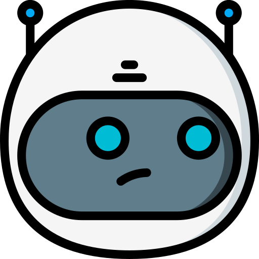
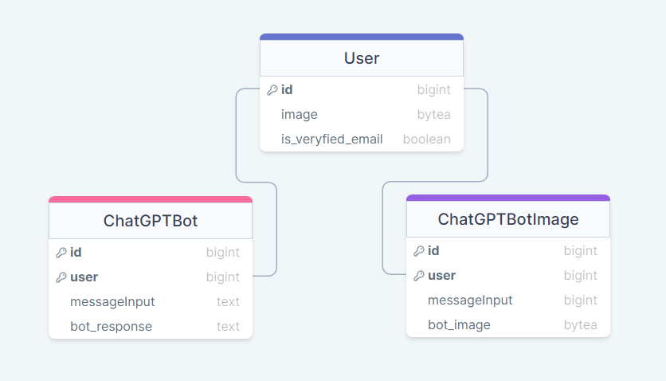
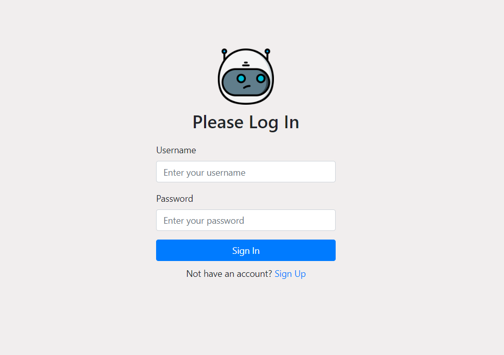
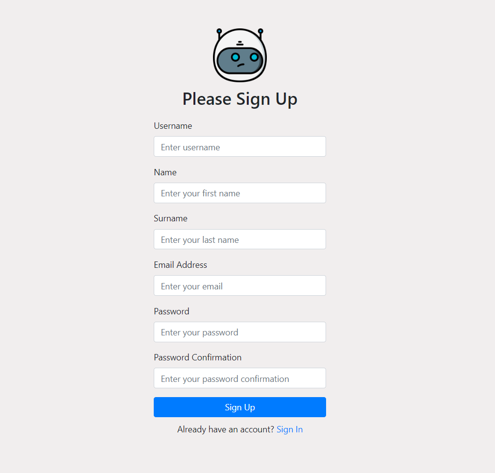

# Chat Synthia

Django application that integrates with the OpenAI API to generate natural language responses and 
generate images to user inputs.

# Technology Stack
* Python/Django
* PostgreSQL
* OpenAI API
* HTML/CSS/Bootstrap

# Database

The project includes three models: ChatGptBot, associated with user input and bot responses; 
ChatGptBotImage, linked to user input and bot-related images; and User (AbstractUser), 
extending the built-in user model with user images and email verification status if it needs.

# Installation
Python3 and Django must be already installed

```
git clone https://github.com/drakoRRR/chatSynthia
cd chatSynthia
python -m venv venv
venv\Scripts\activate (on Windows)
source venv/bin/activate (on macOS)
pip install -r requirements.txt
python manage.py migrate
python manage.py runserver
```
## Docker
```
docker-compose up --build web
docker-compose up
```

Also, you need to set up the .env file as it is set up in the `.env.example` file.

# Usage

The app provides Login, Logout, and Sign up pages for users to create accounts and access full 
functionality, with the added feature of one-click conversation removal to safeguard user privacy.

When a user submits a message through the web interface, the Django application utilizes the OpenAI 
API to generate a response, which is subsequently returned to the user through the same interface. 
The integration with the OpenAI API enables diverse applications, ranging from customer service 
chatbots to intelligent assistants for websites and apps, with an additional feature of generating 
images based on user input.

We can see that this app encompasses all the essential functionality, including generating responses to user input and 
creating images. Additionally, we can observe the functionality of the login system and the ability to delete chat history.

# Summary
Chat Synthia, a Django application, harmoniously integrates with the OpenAI API for natural language responses and image 
generation based on user inputs. The tech stack includes Python/Django, PostgreSQL, and HTML/CSS/Bootstrap. Featuring three 
models, the app extends user models with image storage and email verification status. Users can authenticate via Login,
Logout, and Sign up pages, with a convenient one-click conversation removal for enhanced privacy. The OpenAI API integration 
supports a spectrum of applications, from customer service chatbots to website and app assistants, including image generation
from user input. The installation is straightforward, utilizing Python3 and Django, with Docker support available. The app's 
usage involves submitting messages through the web interface, triggering the OpenAI API for responses, and showcasing interactive c
apabilities through visuals.
